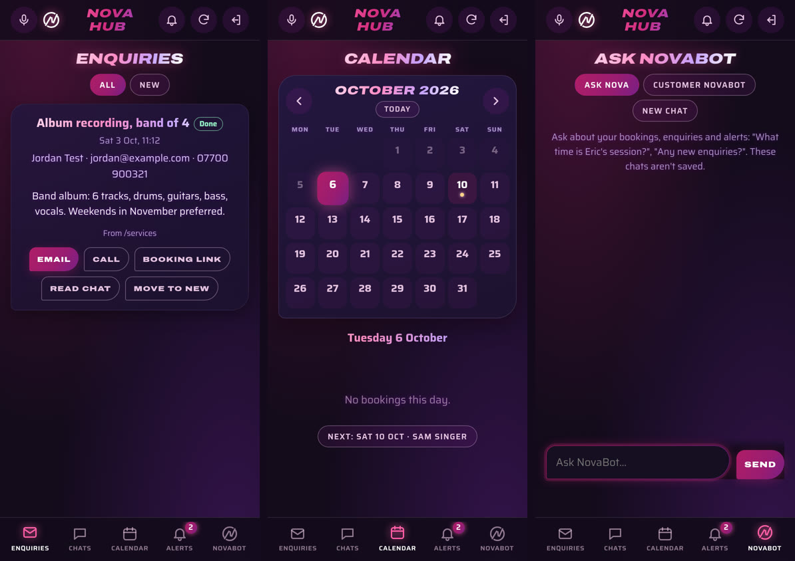
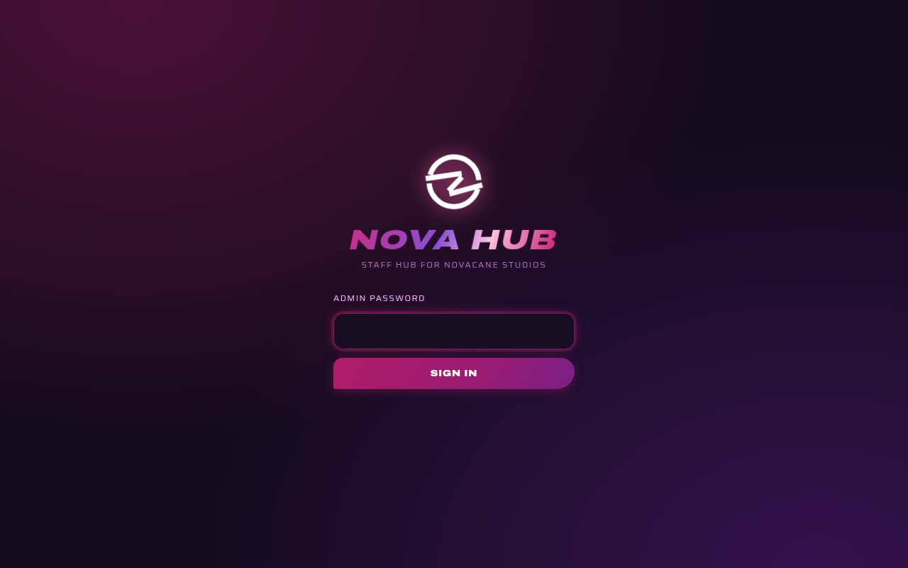
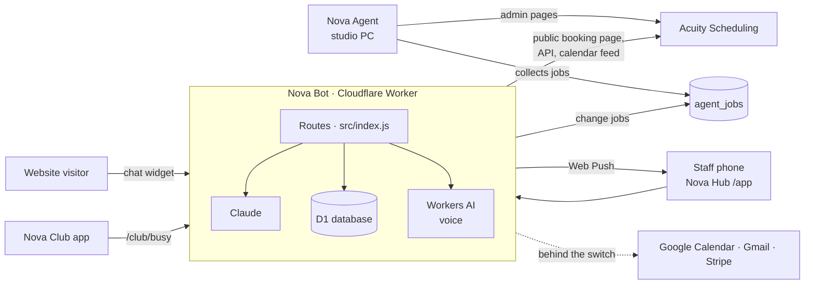

<div align="center">


# Nova Bot

**The front desk that never closes: a chat assistant, booking card and staff app for Novacane Studios.**

[](https://developers.cloudflare.com/workers/)
[](https://www.anthropic.com/claude)
[-003B57?logo=sqlite&logoColor=white)](https://developers.cloudflare.com/d1/)
[](#tests)
[](https://github.com/tuniveza/nova-suite)
[](#licence)

</div>

---

Nova Bot is the AI chat assistant built for [Novacane Studios](https://novacane.co.uk), a
recording studio in London. It runs on Cloudflare Workers, answers questions with Claude,
and sits on the studio's Squarespace website as a chat widget. Behind the widget it runs
**Nova Hub**, a phone-friendly staff app, and a complete booking system of its own that
waits behind a switch.

It comes with a **sandbox**, so you can run the whole thing on your own computer without
any accounts.

## Contents

- [What it does](#what-it-does)
- [Screenshots](#screenshots)
- [How it works](#how-it-works)
- [Run it locally (sandbox)](#run-it-locally-sandbox)
- [Configuration](#configuration)
- [Nova Bot's own booking system](#nova-bots-own-booking-system-behind-a-switch)
- [Tests](#tests)
- [Deploying your own copy](#deploying-your-own-copy)
- [Project layout](#project-layout)
- [Part of the Nova suite](#part-of-the-nova-suite)

## What it does

**On the website**

- **Chat widget** (`public/novabot.js`, `public/novabot.css`): a themed chat panel that
  opens after the page loads, tucks out of the way of buttons and forms, remembers the
  conversation across pages, and has a "Keep chat closed" switch. Optional voice: speak
  to it (Whisper on Workers AI) and hear replies (the browser's voice or MeloTTS).
- **Answers** (`src/index.js`): Claude answers from the studio's own information
  (prices, policies, booking rules). Every link it gives is checked, and anything made
  up is replaced with a real one.
- **Booking links and free times** (`src/booking.js`): reads session types and free start
  times from the studio's *public* Acuity booking page (no login, read-only) and gives
  visitors a link that opens the right session, with the time already selected.
- **The booking card** (`src/booking-form.js`, `src/book-session.js`): "Book a session"
  opens a card in the chat with the session, a strip of days, that day's free times and
  the visitor's details. The Worker checks the time again before anything happens.
- **No booking without payment.** Nothing Nova Bot does puts a session into Acuity
  unpaid. The customer pays the deposit on Acuity's booking page, and that is what books
  it; the time isn't held until they pay.
- **Enquiries** (`src/enquiries.js`): Nova Bot can take an enquiry in the chat, show the
  visitor a summary, and send it to the team once they confirm. It's saved for the admin
  pages and can be emailed (Resend).
- **Safety**: per-visitor rate limits, only allowed websites can use the chat, spam
  limits on enquiries, and IP addresses stored only as a hash.

**For staff**

- **Nova Hub** (`public/app/`, `src/app-page.js`): a phone-friendly staff app at `/app`
  that can be added to a phone's home screen. Enquiries (mark done, booking links,
  email/call), customer chats, a calendar of bookings, alerts, and a chat with Nova Bot.
  Signs in with the admin password (a secure cookie for 30 days).
- **Managing bookings by chat** (`src/manage-bookings.js`): in Nova Hub only, never on the
  website. Staff can ask "what's on Saturday?" or "when is Kai in next?", and cancel,
  reschedule or change a booking's details ("move Dana to 4pm"). Every change shows a
  summary first and only happens after staff say yes.
- **Jobs for Nova Agent** (`src/agent-nova.js`): Acuity's API can't change a booking's
  session type, price or paid status, so those changes are queued for
  [Nova Agent](https://github.com/tuniveza/nova-agent), the browser helper on the studio
  PC, which does them in Acuity's admin pages and reports back.
- **Phone notifications** (`src/push.js`, `public/app/sw.js`): Web Push alerts for new
  enquiries and bookings, with every booking detail (name, phone, email, price, time, form
  answers) read from Acuity's private calendar feed (`src/booking-calendar.js`), with
  Acuity's confirmation page and booking emails as back-ups.
- **Admin pages** (`src/admin.js`): password-protected tabs for enquiries, conversations
  (kept 90 days), referral codes and connections.
- **Health checks** (`src/health.js`): every day at 06:00 UK time the Worker checks it can
  still reach Acuity's API, and alerts staff phones if not.
- **Nova Club feed** (`src/club-calendar.js`): `GET /club/busy` gives the members' app
  ([Nova Club](https://github.com/tuniveza/nova-club)) the studio's busy times, with no
  names or details, only times.

## Screenshots

<table>
  <tr>
    <td width="50%"></td>
    <td width="50%"><br><sub>The booking card: session, day, free start times and details, all in the chat.</sub><br><br><br><sub>The sandbox: a pretend studio site, with clearly labelled stand-in replies when no AI key is set.</sub></td>
  </tr>
</table>

<p align="center">
  <br>
  <sub>Nova Hub, the staff app: enquiries, the bookings calendar and a chat with Nova Bot (sandbox data).</sub>
</p>

<p align="center">
  <br>
  <sub>Signing in to Nova Hub.</sub>
</p>

## How it works



- **One Worker** serves the widget files (`public/`), the chat API, the admin pages,
  Nova Hub, webhooks and a once-a-minute cron (`booking-pings.js`).
- **D1** holds enquiries, chat logs (90 days), referral codes, notifications, settings,
  Nova Agent's job queue and, when switched on, Nova Bot's own bookings
  (`migrations/`).
- **Secrets** live in Cloudflare (`wrangler secret put`), never in the code.

## Run it locally (sandbox)

You need [Node.js](https://nodejs.org) 20 or newer. No Cloudflare, Claude or Acuity
account is needed.

```sh
git clone https://github.com/tuniveza/nova-bot.git
cd nova-bot
npm install
npm run sandbox:setup   # creates .dev.vars from the example, and a local database
npm run sandbox         # starts it at http://localhost:8787
```

Open <http://localhost:8787>: a pretend website with the chat widget on it.

- **Everything stays on your computer.** The sandbox has its own local database and
  can't reach any live Nova Bot, database or calendar.
- **Without an AI key**, Nova Bot gives clearly labelled stand-in replies, so you can try
  the widget, enquiries, Nova Hub and the admin pages for free.
- **For real answers**, put your own Claude API key
  ([console.anthropic.com](https://console.anthropic.com)) in `.dev.vars` as
  `ANTHROPIC_API_KEY=...` and restart. That uses your own Anthropic account.
- **Admin pages and Nova Hub**: <http://localhost:8787/admin> and
  <http://localhost:8787/app>, any username, password `sandbox` (set in `.dev.vars`).
- **The booking card** needs a booking system it can check times against. To try it
  offline, start the sandbox with Nova Bot's own system switched on:
  `npx wrangler dev --env sandbox --var BOOKING_SYSTEM:nova` (no Google key means the
  "calendar" is the local bookings table; no Stripe key means a local stand-in checkout).
- **Voice**: speech uses your browser's own voice; the microphone needs Workers AI, so
  it isn't available in the sandbox.

`.dev.vars` is in `.gitignore`: your keys never get committed.

## Configuration

Everything secret is a **Wrangler secret** (`npx wrangler secret put NAME`), or a line in
`.dev.vars` for local runs. Names only; values never belong in the repository.

| Name | Needed for |
|---|---|
| `ANTHROPIC_API_KEY` | Claude answers (required live) |
| `ADMIN_PASSWORD` | Admin pages and Nova Hub sign-in (required) |
| `ACUITY_USER_ID`, `ACUITY_API_KEY` | Referral tracking, booking checks and managing bookings from Nova Hub (Acuity's Powerhouse plan) |
| `ACUITY_WEBHOOK_KEY` | Accepting Acuity's webhook (`/acuity/webhook?key=…`) |
| `ACUITY_CALENDAR_URL` | Acuity's private calendar feed: booking details and Nova Club's busy times |
| `ACUITY_EMAIL_KEY` | The Google Apps Script that forwards Acuity's emails (`tools/acuity-email-forwarder.gs`) |
| `AGENT_NOVA_KEY` | Nova Agent's routes (`/hub/agent/next`, `/hub/agent/result`, `/hub/notify`) |
| `VAPID_PUBLIC_KEY`, `VAPID_PRIVATE_KEY` | Phone notifications (Web Push) |
| `RESEND_API_KEY`, `ENQUIRY_EMAIL_TO`, `ENQUIRY_EMAIL_FROM` | Emailing enquiries (optional) |
| `GOOGLE_CLIENT_ID`, `GOOGLE_CLIENT_SECRET` | Nova Bot's own booking system: Google Calendar and Gmail (optional) |
| `GOOGLE_REFRESH_TOKEN`, `GOOGLE_CALENDAR_ID`, `GOOGLE_ACCOUNT` | Optional overrides; normally set by "Connect Google" on `/admin/connections` |
| `STRIPE_SECRET_KEY`, `STRIPE_WEBHOOK_SECRET` | Nova Bot's own booking system: deposits (optional) |

Plain variables (in `wrangler.jsonc` or `--var`): `BOOKING_SYSTEM` (`acuity` or `nova`, the
fallback for the switch), `PUBLIC_URL`, `SANDBOX`, `BOOKING_DETAILS_WAIT_SECONDS`.

Bindings in `wrangler.jsonc`: `DB` (D1), `AI` (Workers AI), `CHAT_LIMIT`, `VOICE_LIMIT` and
`CLUB_LIMIT` (rate limits), static assets from `public/`, and a cron trigger every minute.

More detail lives alongside this file:
[README-ENQUIRIES.md](README-ENQUIRIES.md) (enquiries, booking links, free times, chat log),
[README-REFERRALS.md](README-REFERRALS.md) (referral codes and Acuity's webhook),
[README-SQUARESPACE.md](README-SQUARESPACE.md) (adding the widget to a Squarespace site) and
[PRIVACY-POLICY-NOVABOT.md](PRIVACY-POLICY-NOVABOT.md) (privacy policy wording).

<details>
<summary><b>Booking details from Acuity's confirmation page</b> (optional back-up)</summary>

Paste this into Acuity → Integrations → Custom conversion tracking, under anything already
there, replacing `YOUR-WORKER` with your Worker's address:

```html
<!-- Nova Hub: sends this booking's details to the staff notification -->
<div id="nv-booked" hidden><i>%type%</i><i>%id%</i><i>%appointmentType%</i><i>%clientDate%</i><i>%clientTime%</i><i>%price%</i><i>%email%</i><i>%calendar%</i></div>
<script>
(function () {
  var names = ["type", "id", "session", "date", "time", "price", "email", "calendar"];
  var values = document.querySelectorAll("#nv-booked i");
  var query = names.map(function (name, i) { return name + "=" + encodeURIComponent(values[i].textContent.trim()); }).join("&");
  new Image().src = "https://YOUR-WORKER/acuity/booked?" + query;
})();
</script>
```

The main source of booking details is Acuity's private calendar feed (Acuity → Sync with
Other Calendars → 1-way Calendar Sync, saved as `ACUITY_CALENDAR_URL`), which works on every
Acuity plan and for bookings staff add themselves. Acuity's own booking emails are a second
back-up: `tools/acuity-email-forwarder.gs` runs in the mailbox Acuity emails and passes each
one to `/acuity/email`. Once emails are coming through, notifications wait for them (up to
3 minutes, then the once-a-minute cron sends them anyway).

</details>

## Nova Bot's own booking system (behind a switch)

Bookings go through **Acuity** by default. Alongside it, `src/nova/` holds Nova Bot's own
booking system, switched **off** until you choose otherwise:

- **Booking page** at `/book`, with the studio's **Google Calendar** as the diary,
  confirmation emails from the studio's **Gmail**, and deposits through **Stripe**.
- **Customer pages**: each customer gets a page to pay, move or cancel.
- **Staff tools** in Nova Hub: cancel, move, refund and send payment links.

**The switch** is on `/admin/connections`, under "Booking system". It's stored in the
`settings` table as `booking_system` (`acuity` or `nova`), and falls back to the
`BOOKING_SYSTEM` variable, then to Acuity (`src/mode.js`).

- It takes effect straight away, with no redeploy.
- Nova can only be switched on once Google and Stripe both work. Switching back to Acuity
  is always one click.
- On Acuity, everything behaves exactly as before, and the original tests prove it.
- Either way, a booking made with Nova keeps working (its page, payment links and Stripe's
  webhook), and Acuity's webhook is still listened to.

<details>
<summary><b>Setting it up</b></summary>

1. **Google:** in Google Cloud, switch on the Calendar and Gmail APIs and create an OAuth
   client (Web application) with the redirect URI `https://<worker>/admin/google/callback`.
   Then `npx wrangler secret put GOOGLE_CLIENT_ID` and `GOOGLE_CLIENT_SECRET`.
2. **Stripe:** `npx wrangler secret put STRIPE_SECRET_KEY` (use a `sk_test_…` key to try
   it). Add a webhook endpoint `https://<worker>/stripe/webhook` with the events
   `checkout.session.completed`, `checkout.session.async_payment_succeeded` and
   `checkout.session.expired`, and save its signing secret as `STRIPE_WEBHOOK_SECRET`.
3. **Database:** `npx wrangler d1 migrations apply novabot --remote`.
4. **Deploy,** then on `/admin/connections`: press **Connect Google**, press **Send a test
   email**, and flip the switch to try it.

Sessions, prices and rules (opening hours, 50% deposit, 48-hour cancellation) are in
`src/nova/studio.js`.

</details>

## Tests

```sh
npm test            # watch mode
npx vitest run      # once
```

352 tests across 23 files, fully offline: they run inside the Workers runtime
(`@cloudflare/vitest-plugin`) with a local database and fake versions of Claude, Acuity,
Google, Stripe and Resend (`test/fakes.js`). Every key in `vitest.config.mjs` is a
test-only stand-in. The original Acuity tests run against the default; `test/*-nova.spec.js`
run with the switch on Nova, and `test/switch.spec.js` tests the switch itself.

## Deploying your own copy

1. Log in to Cloudflare: `npx wrangler login`.
2. Create the database: `npx wrangler d1 create novabot`, put its `database_id` in
   `wrangler.jsonc`, then `npx wrangler d1 migrations apply novabot --remote`.
3. Add the secrets you need from [Configuration](#configuration), at least
   `ANTHROPIC_API_KEY` and `ADMIN_PASSWORD`.
4. Swap Novacane's details for your own:
   - `src/index.js`: `BOOKING_LINK`, `ENQUIRY_LINK`, `WHATSAPP_NUMBER`, `WHATSAPP_LINK`,
     `ALLOWED_ORIGINS`, and the studio information in `STUDIO_INFO`
   - `src/booking.js`: `ACUITY_OWNER` (the number after `owner=` in your Acuity booking
     page's address)
   - `src/nova/studio.js` and `src/nova/booking.js` (`LIVE_URL`) for the Nova system
   - `public/novabot.js`: `LIVE_WORKER_URL`, `BOOKING_LINK`, `PRIVACY_LINK`
5. Deploy with `npm run deploy`, then add the widget to your website (see
   [README-SQUARESPACE.md](README-SQUARESPACE.md)).

## Project layout

```
public/novabot.js, novabot.css   the chat widget (served by the Worker)
public/app/                      Nova Hub, the staff app (PWA + service worker)
src/index.js                     the Worker: chat, voice, routes, Nova Bot's instructions
src/booking.js                   session types, booking links, free times (public Acuity page)
src/booking-form.js              the booking card's API
src/book-session.js              booking checks (deposit first)
src/manage-bookings.js           staff finding, cancelling, moving and changing bookings
src/agent-nova.js                jobs for Nova Agent and its alerts
src/enquiries.js                 enquiries, enquiry emails, chat log
src/admin.js                     admin pages
src/app-page.js                  Nova Hub's data
src/push.js                      notifications and the Alerts tab
src/booking-calendar.js          booking details from Acuity's calendar feed
src/booking-details.js           booking details from Acuity's confirmation page
src/booking-emails.js            booking details from Acuity's emails
src/booking-pings.js             when booking notifications go out
src/club-calendar.js             busy times for Nova Club
src/referrals.js                 referral tracking (Acuity API)
src/health.js                    daily Acuity API check
src/mode.js                      the booking-system switch
src/nova/                        Nova Bot's own booking system (Google, Gmail, Stripe)
src/fonts/                       Saira, Geist Mono and Source Code Pro (SIL OFL)
migrations/                      D1 tables
test/                            Vitest tests and fakes
tools/acuity-email-forwarder.gs  Google Apps Script that forwards Acuity's emails
scripts/sandbox-setup.mjs        sandbox setup
docs/media/                      README images
```

## Part of the Nova suite

| Project | What it is |
|---|---|
| [nova-suite](https://github.com/tuniveza/nova-suite) | The Nova suite: an overview of every project |
| **[nova-bot](https://github.com/tuniveza/nova-bot)** | This repo: the website chat assistant, booking card and Nova Hub |
| [nova-agent](https://github.com/tuniveza/nova-agent) | Browser helper that does jobs in Acuity's admin pages |
| [nova-club](https://github.com/tuniveza/nova-club) | Members' Android app that shows the studio's busy times |
| [nova-calendar](https://github.com/tuniveza/nova-calendar) | A cosmic calendar of note cards and day cards |
| [nova-notes](https://github.com/tuniveza/nova-notes) | Nova Notes (in progress) |
| [nova-observatory](https://github.com/tuniveza/nova-observatory) | A dashboard of every project, with screenshots and video |

## Licence

All rights reserved — Novacane Studios. The bundled fonts in `src/fonts/` keep their own
SIL Open Font Licence (see the `OFL.txt` files).
