<div align="center">

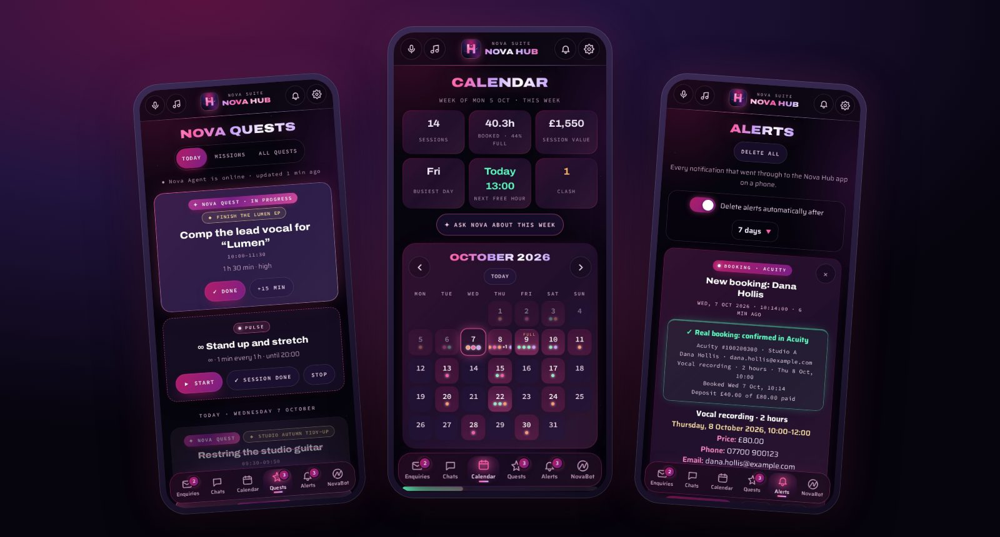

# Nova Bot

**The front desk that never closes: a website assistant, a staff app and the engines behind the Nova suite, for Novacane Studios.**

[](https://developers.cloudflare.com/workers/)
[](https://www.anthropic.com/claude)
[-003B57?logo=sqlite&logoColor=white)](https://developers.cloudflare.com/d1/)
[](#tests)
[](https://github.com/tuniveza/nova-suite)
[](#licence)

</div>

---

Nova Bot runs on Cloudflare Workers for [Novacane Studios](https://novacane.co.uk), a
recording studio in London. One Worker does four jobs:

| | What it is | Where |
|---|---|---|
| ✦ **NovaBot** | The chat assistant on the studio's website. Answers questions with Claude and gets bookings ready, always with the deposit first | `public/novabot.js`, `src/index.js` |
| ✦ **Nova Hub** | The staff app: enquiries, chats, a smart calendar, quests, alerts and a staff chat with NovaBot | `public/app/`, `src/app-page.js` |
| ✦ **Admin pages** | Password-protected pages for referrals, enquiries, conversations, feedback, the booking system and the master list of links | `src/admin.js` |
| ✦ **Suite engines** | The memory behind **Nova Index** and the sign-in behind **Nova Portal**, shared by every Nova app | `src/memory/`, `src/portal/` |

It comes with a **sandbox**, so you can run the whole thing on your own computer without
any accounts.

> Every screenshot and animation here was made with made-up data (Dana Hollis, Eric
> Mensah, Kai and friends, `example.com` addresses and `07700 900xxx` numbers). No real
> customers appear anywhere.

## Contents

- [NovaBot, on the website](#novabot-on-the-website)
- [Nova Hub, the staff app](#nova-hub-the-staff-app)
- [The admin pages](#the-admin-pages)
- [Nova Index: the memory engine](#nova-index-the-memory-engine)
- [Nova Portal: one sign-in for the suite](#nova-portal-one-sign-in-for-the-suite)
- [How it works](#how-it-works)
- [Run it locally (sandbox)](#run-it-locally-sandbox)
- [The build step](#the-build-step)
- [Configuration](#configuration)
- [Nova Bot's own booking system](#nova-bots-own-booking-system-behind-a-switch)
- [Tests](#tests)
- [Deploying your own copy](#deploying-your-own-copy)
- [Project layout](#project-layout)
- [Part of the Nova suite](#part-of-the-nova-suite)

## NovaBot, on the website

<table>
  <tr>
    <td width="50%">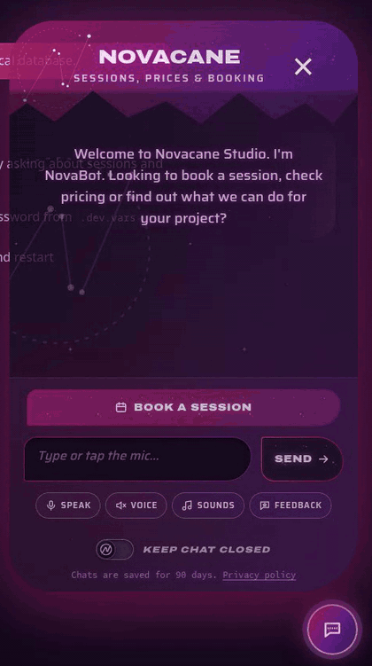</td>
    <td width="50%">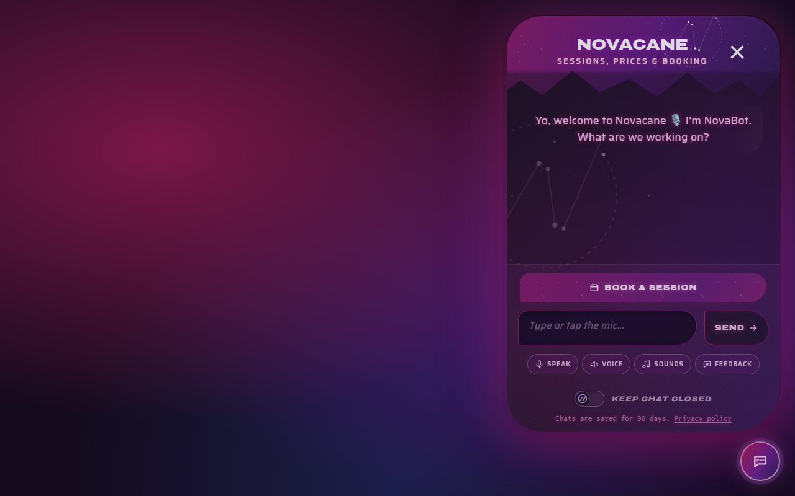<br><sub>The chat widget on a page.</sub><br><br>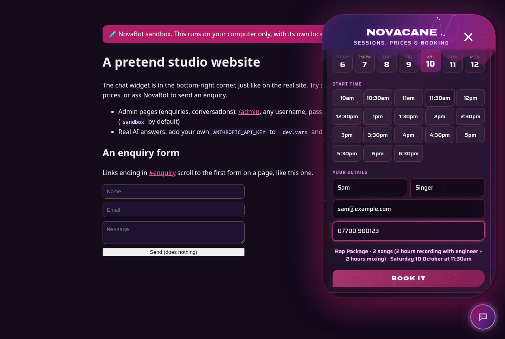<br><sub>The booking card: session, day, free start times and details, all in the chat.</sub></td>
  </tr>
</table>

- **It answers questions** (`src/index.js`). Claude answers from the studio's own
  information: prices, policies and booking rules. Every link it gives is checked, and
  anything made up is replaced with a real one.
- **Bookings always take the deposit.** Nothing NovaBot does puts a session into Acuity
  unpaid (`src/book-session.js`). It works out the session, checks the time is still free
  and fills in the customer's details, then hands them Acuity's own booking page with
  everything ready. Paying the deposit there is what books it; the time isn't held until
  they pay. The same rule covers the staff chat and Nova Agent.
- **The chat widget** (`public/novabot.js`, `public/novabot.css`): opens after the page
  loads, keeps out of the way of buttons and forms, remembers the conversation across
  pages, and has a "Keep chat closed" switch. Optional voice: speak to it (Whisper on
  Workers AI) and hear replies (the browser's voice or MeloTTS).
- **Booking links and free times** (`src/booking.js`): reads session types and free start
  times from the studio's *public* Acuity booking page (no login, read-only).
- **The booking card** (`src/booking-form.js`): "Book a session" opens a card in the chat
  with the session, a strip of days, that day's free times and the visitor's details. The
  Worker checks the time again before anything happens.
- **Enquiries** (`src/enquiries.js`): NovaBot can take an enquiry, show the visitor a
  summary, and send it to the team once they confirm. It's saved for Nova Hub and the
  admin pages, and can be emailed (Resend).
- **Safety**: per-visitor rate limits, only allowed websites can use the chat, spam
  limits on enquiries, and IP addresses stored only as a hash.

## Nova Hub, the staff app

Nova Hub lives at `/app`. It's a phone-first web app that installs to the home screen,
and turns into a side-rail layout on a desktop. Staff sign in with
[Nova Portal](#nova-portal-one-sign-in-for-the-suite) (or, for now, the studio's shared
password).

<table>
  <tr>
    <td width="33%" valign="top">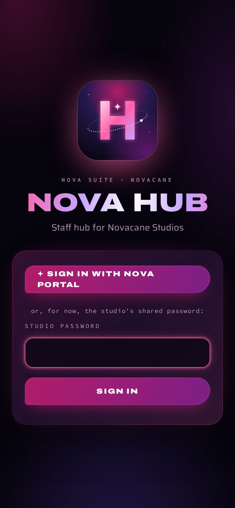<br><sub><b>Sign in</b> with Nova Portal, or the studio's shared password.</sub></td>
    <td width="33%" valign="top">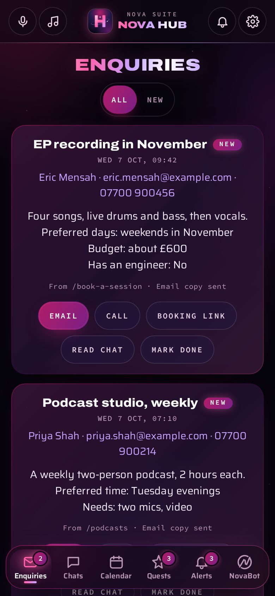<br><sub><b>Enquiries</b>: email, call, send a booking link, read the chat, mark done.</sub></td>
    <td width="33%" valign="top">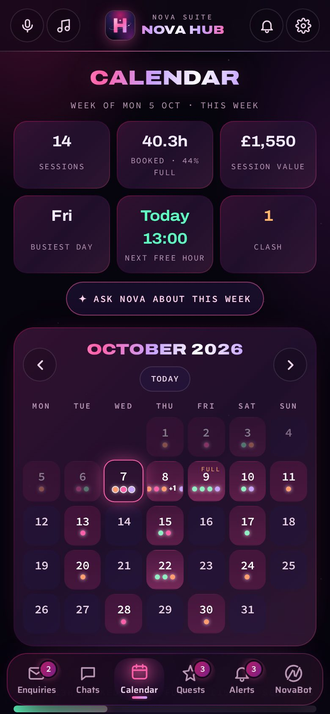<br><sub><b>The smart calendar</b>: the week at a glance, and days that glow as they fill.</sub></td>
  </tr>
  <tr>
    <td width="33%" valign="top">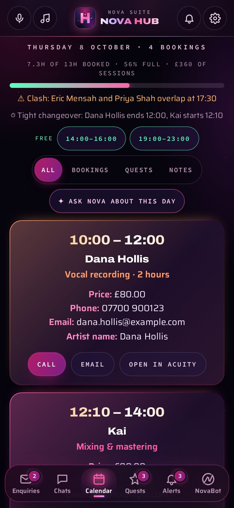<br><sub><b>A day</b>: how full it is, a clash, a tight changeover, and free slots.</sub></td>
    <td width="33%" valign="top">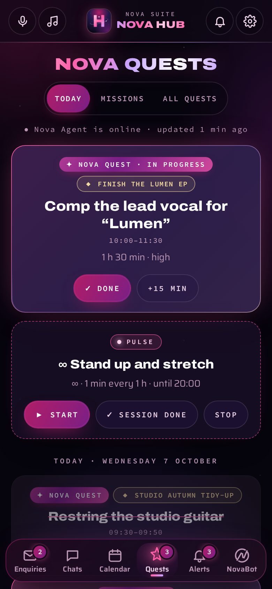<br><sub><b>Nova Quests</b> from Nova Agent: what's on now and today's plan.</sub></td>
    <td width="33%" valign="top">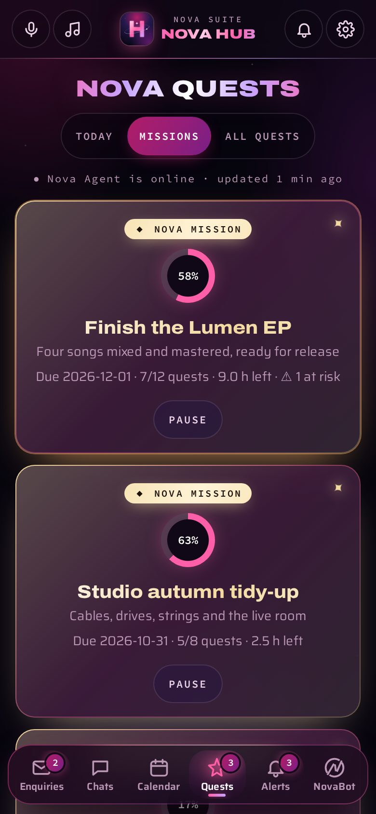<br><sub><b>Nova Missions</b>: progress, deadlines and anything at risk.</sub></td>
  </tr>
  <tr>
    <td width="33%" valign="top">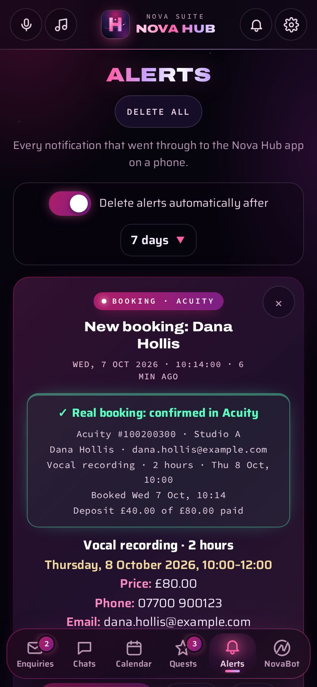<br><sub><b>Alerts</b>: every booking is checked with Acuity itself.</sub></td>
    <td width="33%" valign="top">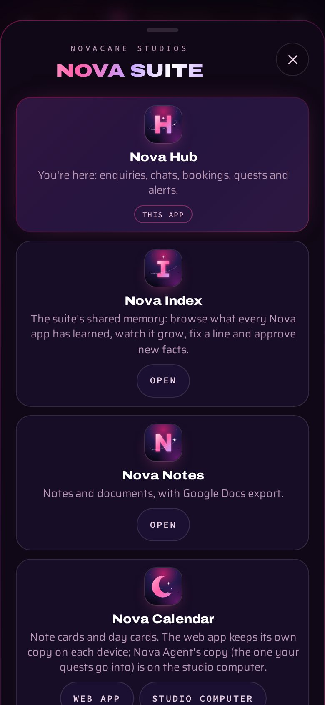<br><sub><b>The Nova suite sheet</b>: every app, one tap away.</sub></td>
    <td width="33%" valign="top">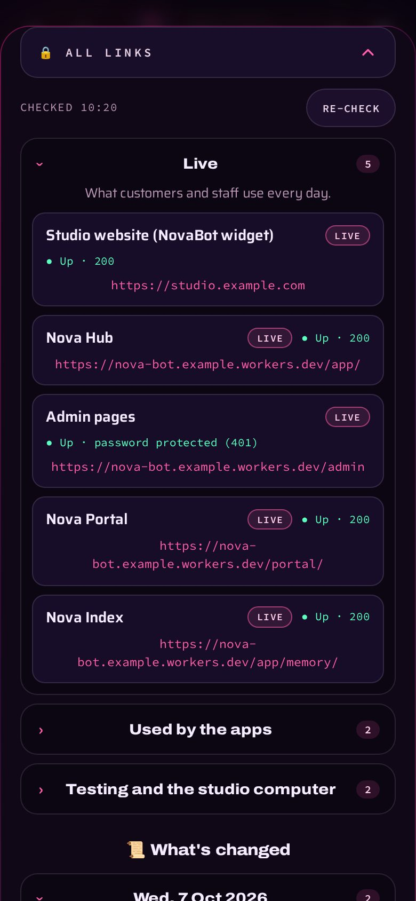<br><sub><b>🔒 All links</b>, each checked as you open it.</sub></td>
  </tr>
  <tr>
    <td width="33%" valign="top">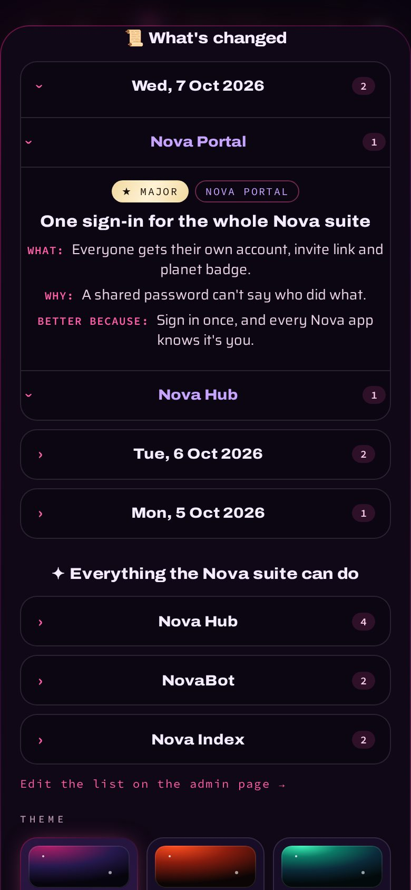<br><sub><b>What's changed</b> and <b>everything the suite can do</b>.</sub></td>
    <td width="33%" valign="top">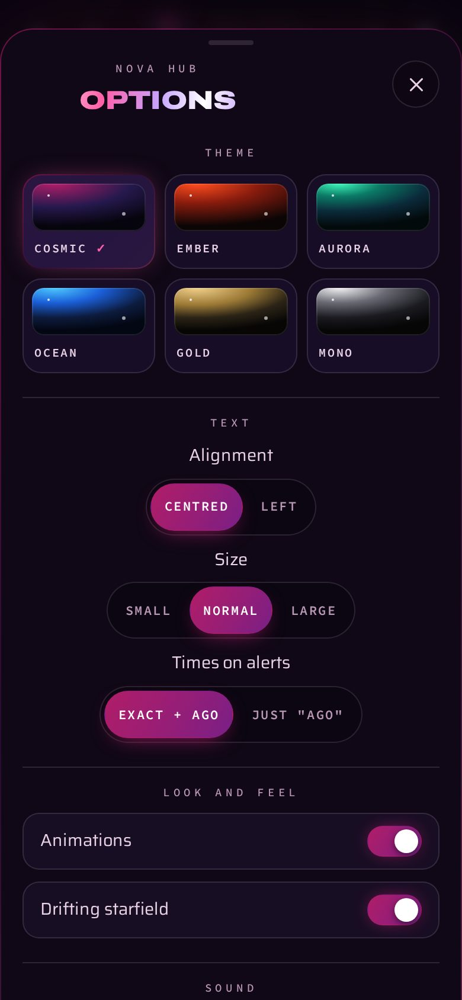<br><sub><b>Options</b>: theme, text, motion, sound and the starting tab.</sub></td>
    <td width="33%" valign="top">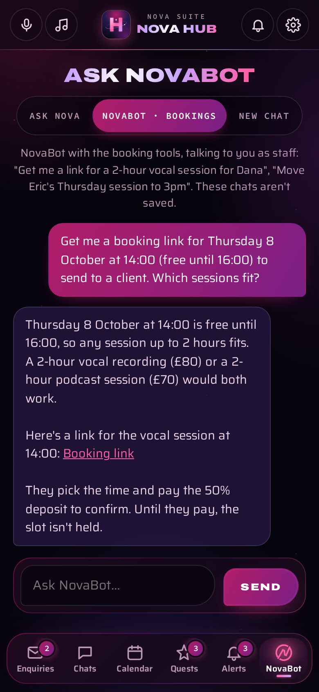<br><sub><b>Ask NovaBot</b> in staff mode: a booking link, deposit first.</sub></td>
  </tr>
</table>

<p align="center">
  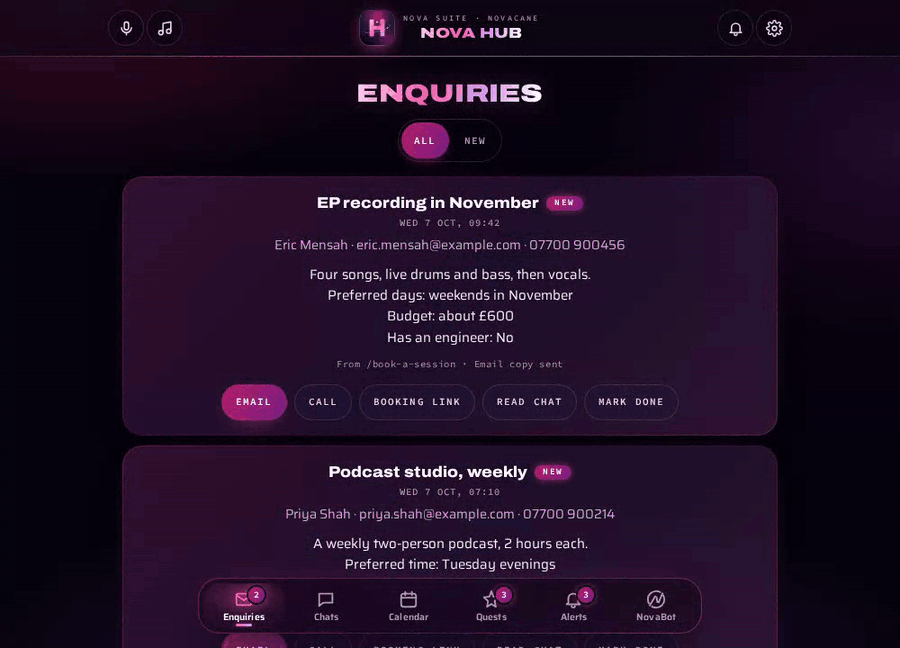<br>
  <sub>Tap a free slot, and NovaBot · bookings opens with the request already written.</sub>
</p>

### The tabs

| Tab | What it does |
|---|---|
| **Enquiries** | Every enquiry NovaBot took. Email, call, make a booking link with the customer's details filled in, read the chat it came from, mark it done. |
| **Chats** | What customers asked NovaBot on the website (kept for 90 days). |
| **Calendar** | Every booking in Acuity's diary, as a month you can swipe, with Nova Calendar's cards and planned quests alongside. See [the smart calendar](#the-smart-calendar). |
| **Quests** | Nova Agent's plan, synced from the studio computer: the quest on now, repeating pulses, today, Nova Missions with progress rings, and every quest. Taps (Start, Done, +15 min, Not now, Skip, Pause) go straight back to Nova Agent. |
| **Alerts** | Every notification that reached a phone, newest first, with colour-coded labels, exact times, Call/Email buttons and an auto-delete switch. |
| **NovaBot** | Two chats. **Ask Nova** answers questions about the studio's bookings, enquiries and alerts (`src/hub-ask.js`). **NovaBot · bookings** is NovaBot with the booking tools, talking to you as staff: get a link for a client, find, move, cancel or change a booking. Every change shows a summary and waits for a yes. |

### The smart calendar

- **The week at a glance**: sessions, hours booked and how full, session value, the
  busiest day, the next free hour, and any clashes.
- **Glowing days**: each day glows brighter as it fills; a nearly full day says FULL.
- **A day in detail**: hours booked, a fill meter, ⚠ clashes, ⏱ tight changeovers (under
  15 minutes), and free slots of an hour or more within opening hours.
- **One tap from a booking link**: tapping a free slot opens NovaBot · bookings with the
  request written for you. "✦ Ask Nova" buttons ask about the week or the day.

### Features

- **Real-booking checks.** A booking alert asks Acuity about that booking as it comes into
  view: "✓ Real booking: confirmed in Acuity", with the deposit paid, or "Cancelled" or
  "Not found". Tests are labelled as tests, so nothing fake can pass for a booking.
- **Push notifications that work with the app closed** (`src/push.js`, `public/app/sw.js`).
  New enquiries, bookings (with every detail from Acuity's private calendar feed), and
  alerts from Nova Agent, Nova Quest and Nova Mission. Android gets rich notifications
  with their own buzz; iPhones get the plain version, so nothing is ever lost.
- **Pings.** With Nova Hub open, an alert rings out with a bright ping (a different one for
  each kind) and drops a banner from the top.
- **Staff voice.** Tap the mic and say what to do ("show alerts", "call Eric", "new
  enquiries", "ask NovaBot what the prices are"); Whisper on Workers AI writes it down.
  Hands-free mode listens while the app is open for anything that starts with "Nova".
- **Quests from Nova Agent** (`src/agent-nova.js`): Nova Agent sends its plan here every
  time it changes, and picks up taps within about a second.
- **Ambient music** (`public/app/ambient.js`): a gentle, never-ending soundtrack made live
  on the phone with the Web Audio API. No audio files.
- **Sound effects** (`public/app/sfx.js`): soft bells and sparkles for taps, tabs,
  switches, sends and deletes, all in one key, and a two-note chime when NovaBot answers.
- **Six themes**: Cosmic, Ember, Aurora, Ocean, Gold and Mono, shared with the admin pages.
- **Options** (`public/app/options.js`): theme, text alignment and size, how times show on
  alerts, animations, the drifting starfield, sound effects, pings, music volume and the
  starting tab. Saved on the device.
- **The suite sheet** (`public/app/suite.js`): tap the Nova Hub brand to see every Nova app,
  🔒 **All links** (every live and testing address, each checked on the spot), **What's
  changed** (every change by day and app: what, why and what's better), **everything the
  suite can do**, and the theme picker.

<table>
  <tr>
    <td width="50%">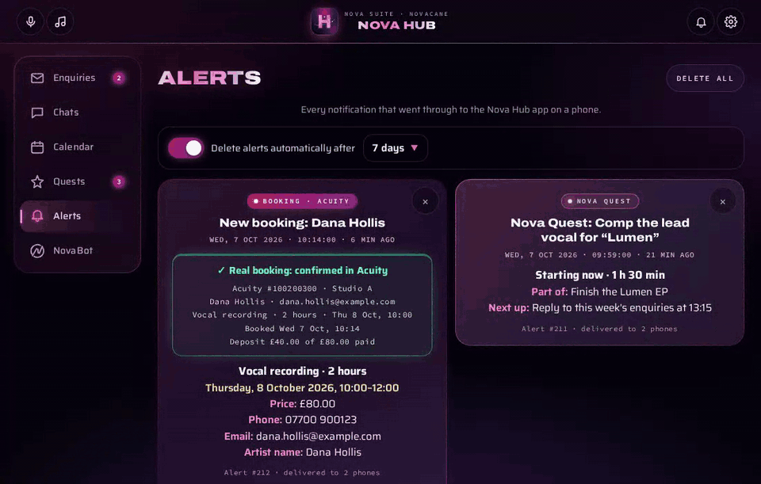<br><sub>Switching themes in Options.</sub></td>
    <td width="50%">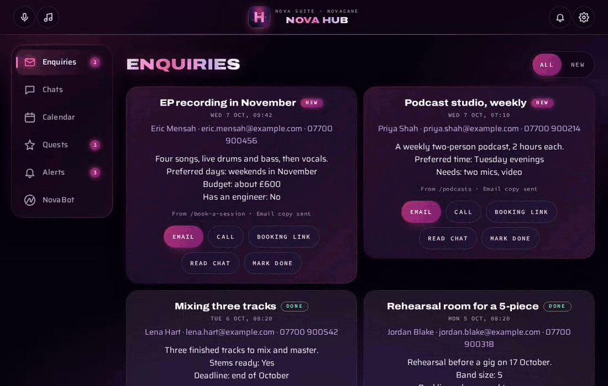<br><sub>Browsing the suite sheet.</sub></td>
  </tr>
</table>

<p align="center">
  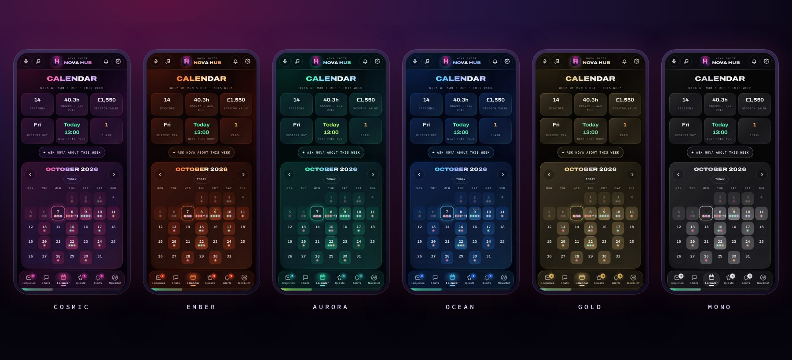<br>
  <sub>One screen, six themes.</sub>
</p>

<p align="center">
  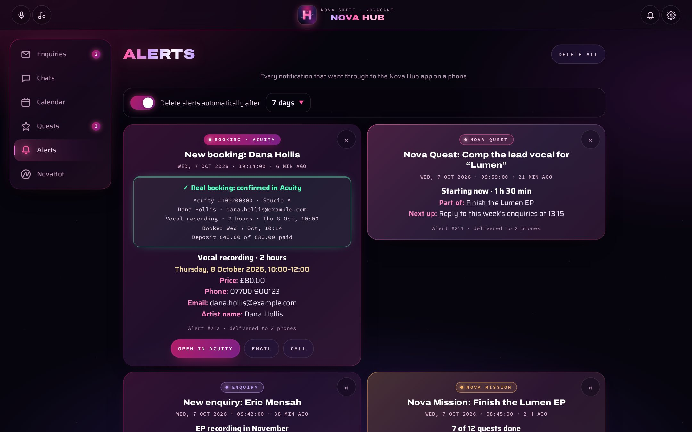<br>
  <sub>On a desktop, the tabs become a side rail and lists go two-up.</sub>
</p>

<details>
<summary><b>Ask Nova</b> (questions about the studio's own diary)</summary>
<br>
<p align="center">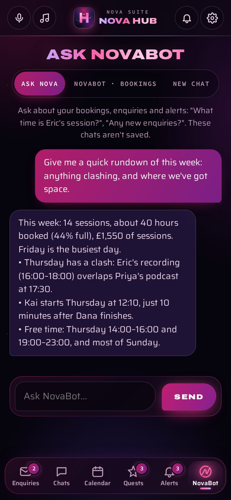</p>
</details>

**Behind the scenes:** Acuity's API can't change a booking's session type, price or paid
status, so those changes are queued for [Nova Agent](https://github.com/tuniveza/nova-agent),
the browser helper on the studio computer, which does them in Acuity's admin pages and
reports back (`src/agent-nova.js`). Every day at 06:00 UK time the Worker checks it can
still reach Acuity's API and alerts staff phones if not (`src/health.js`).

## The admin pages

`/admin`, in Nova Hub's look and themes. Sign in as a Nova Portal admin, or with the
studio's shared password (any username).

| Page | What's there |
|---|---|
| **Referrals** (`/admin`) | Referral codes, the appointments they brought in, and a CSV report |
| **Enquiries** | Every enquiry, mark done, and a test email |
| **Conversations** | Recent chats (kept 90 days), one in full with `?chat=ID` |
| **Feedback** | What visitors said about NovaBot, good and bad |
| **Booking system** (`/admin/connections`) | The Acuity / Nova switch, plus Google and Stripe |
| **Links** (`/admin/links`) | The master list: every address with a live check, **What's changed**, and **everything the suite can do**. Edited here as JSON |

<p align="center">
  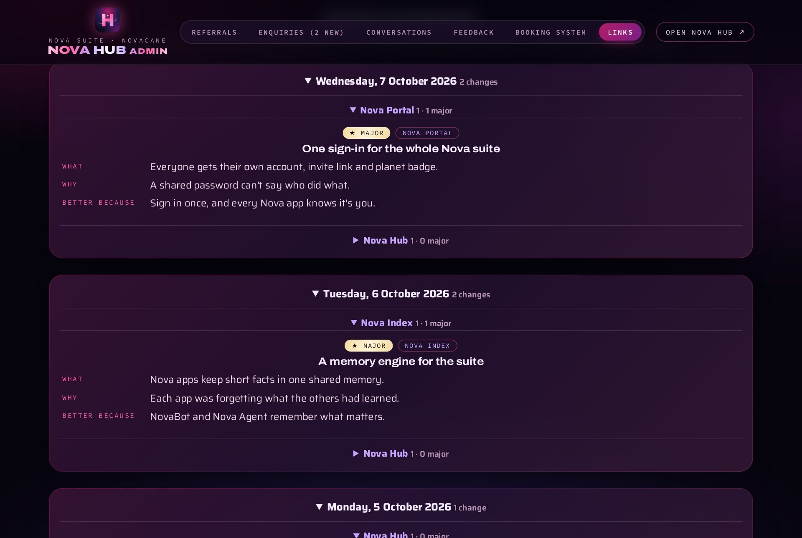<br>
  <sub>The Links page's changelog (sample entries).</sub>
</p>

The master list is kept in the database (`settings`), never in the code, because the code
is public. Nova Hub's suite sheet reads the same list from `/app/api/links`
(`src/links.js`).

## Nova Index: the memory engine

<p align="center">
  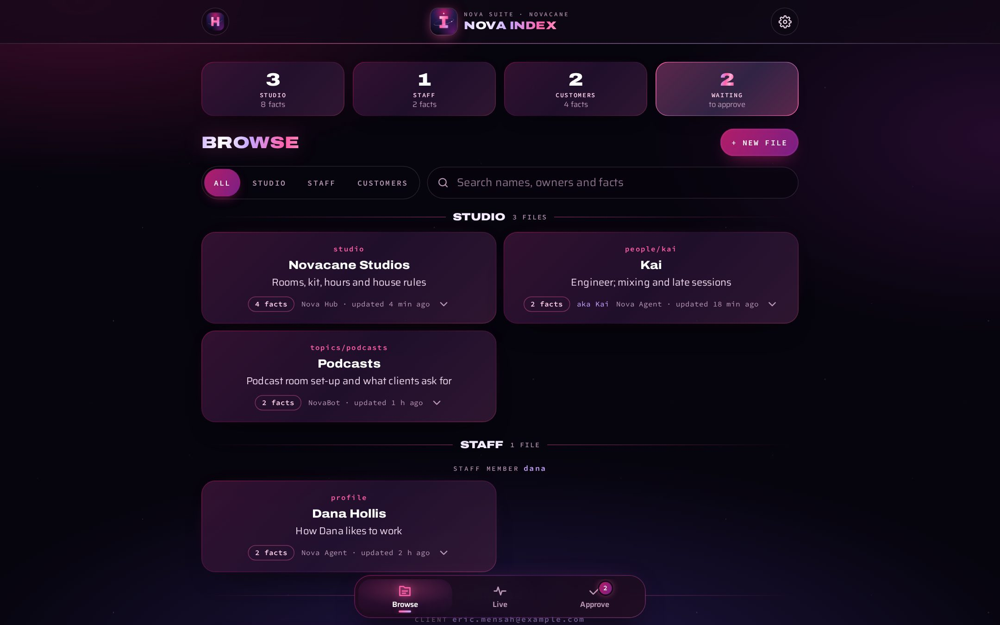<br>
  <sub>Nova Index, browsing the suite's memory (sample data).</sub>
</p>

`src/memory/` is one shared memory for the Nova suite. [Nova Index](https://github.com/tuniveza/nova-index) (its own app, copied in
at `/app/memory/`) is the window onto it; NovaBot, Nova Hub and Nova Agent read and add to
it.

**How it's kept.** Small files of one-line facts, one file per subject, in D1 (never in
git). Each line is tagged: `[stated]` said directly, `[observed]` seen in bookings or
behaviour, `[inferred]` a pattern. Files stay small (about 3 KB; a condense pass tidies
them), and at most about 800 tokens of memory go into any one prompt.

**Scopes, and who sees what.** The caller's role decides, never what it asks for.

| Scope | Holds | Read by | Written by |
|---|---|---|---|
| `studio` | The studio's shared facts: people, topics, areas | Staff, Nova Agent, Portal members | Staff, Nova Agent |
| `staff` | Each staff member's own partition | Staff, Nova Agent; a Portal member sees only their own | Staff, Nova Agent, the member themself |
| `customer` | One file per client (their email, or the chat until it's known) | Staff; NovaBot on the website sees only *that* customer's file | Staff (website facts wait for approval) |

**What it learns, and when.** Always in the background, never while someone waits:

- **Nova Hub's staff chats**: facts are saved straight away (staff are trusted).
- **Website chats**: the every-minute job reads a chat once it's been quiet for 10 minutes
  (or every 20 messages), two chats a run. Facts about clients go into an **approval
  queue** in Nova Index instead of being saved.
- **Nova Agent**: hands over conversation chunks with `POST /memory/extract`.

Each pass asks a small model for **durable** facts only ("would this still be true and
useful in three months?"), and folds them into the file: a new line on the same subject
replaces the old one rather than contradicting it. Writes carry a version token, so two
apps can't overwrite each other.

**Privacy.** Card numbers, bank details, sort codes, National Insurance and passport
numbers and passwords are refused at the door. Nothing is learned while a visitor waits.
The website only ever sees the public studio file and that customer's own file, and client
facts need a person to approve them.

<details>
<summary><b>The API</b></summary>

For Nova Agent (`Authorization: Bearer <AGENT_NOVA_KEY>`):

| Route | Does |
|---|---|
| `GET /memory/context?scope=&owner_id=&q=` | The files that matter for this turn, as text |
| `GET /memory/file?scope=&owner_id=&path=` | One file and its version token |
| `PUT /memory/file` | Write a file (`if_version: "new"` or the token; 409 with the current file on a clash) |
| `POST /memory/extract` | Hand over a conversation chunk; learned in the background (202) |
| `GET /memory/index?scope=` | The listing (no bodies) |

For Nova Hub and Nova Index (signed in), under `/app/api/memory/`: `index`, `file`
(GET/PUT/DELETE), `pending`, `pending/:id` (approve or reject, optionally with an edited
fact), and `stats`.

</details>

## Nova Portal: one sign-in for the suite

<table>
  <tr>
    <td width="50%">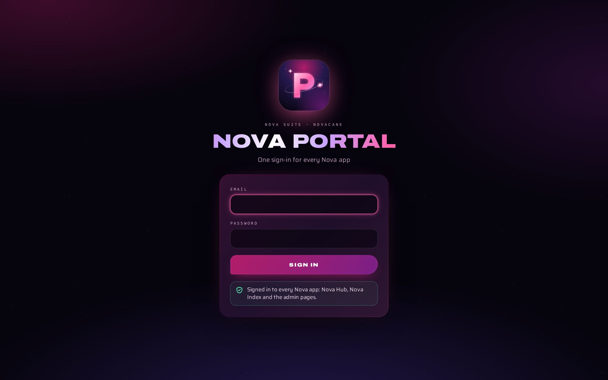<br><sub>Sign in once for every Nova app.</sub></td>
    <td width="50%">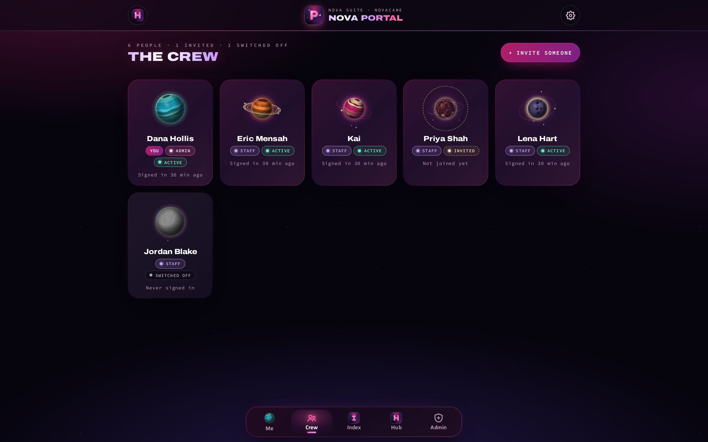<br><sub>The crew, each with their own planet (sample people).</sub></td>
  </tr>
</table>

`src/portal/` signs people in once for Nova Hub, Nova Index and the admin pages. The
Portal's pages live in the **nova-portal** repo (`ns/np`) and are copied
in at build time (see [the build step](#the-build-step)); this Worker serves them at
`/portal/` and runs the API.

- **Accounts.** Everyone has their own (`staff` table): a readable id like `dana`, an
  email, a display name, a role and a status (active, invited or switched off). The first
  admin is set up with the studio's current password.
- **Invites.** An admin invites someone by email and gets a link that works once, for 7
  days. Only a hash of its token is stored. The new person chooses a password and is
  signed in.
- **Passwords.** PBKDF2-SHA256 with 100,000 rounds and a random salt for each person; a
  few tries a minute at most per address.
- **Sessions.** A random token in an httpOnly, Secure cookie for 30 days (or an app token,
  `Authorization: Bearer nsess_…`, for native apps). Only its SHA-256 is stored, and
  signing out deletes it, so it stops working everywhere at once.
- **Roles.** `admin` (everything, including the crew and the admin pages) or `staff`.
  A staff member who isn't an admin sees the studio's memory and their own partition of
  Nova Index.
- **Planets.** Every person gets a planet, drawn fresh from their seed by the planet
  generator: `GET /staff/:id/planet.svg?size=&animate=1`. It's their avatar across the
  suite.
- **The shared password still works** for now, so nobody is locked out while everyone
  gets an account.

<details>
<summary><b>The API</b></summary>

| Route | Does |
|---|---|
| `POST /auth/login` | `{ email, password, client? }` → session cookie (or an app token) |
| `POST /auth/logout` | Ends this session everywhere |
| `GET /auth/me` | Who's signed in (every app starts with this) |
| `GET /auth/status` | `{ setupNeeded }` |
| `POST /auth/setup` | The first admin, proven with the studio's current password |
| `GET /auth/invite?token=` / `POST /auth/invite/accept` | Who an invite is for; choose a password |
| `GET /staff`, `POST /staff` | Admins: everyone; invite someone |
| `POST /staff/:id/invite` | Admins: a fresh invite link |
| `GET /staff/:id`, `PATCH /staff/:id` | A profile; change it (admins: role and status too) |
| `GET /staff/:id/planet.svg` | The planet badge |
| `GET /staff/:id/index` | That person's Nova Index view |

Changes from a browser must come from this site (the Origin header).

</details>

## How it works

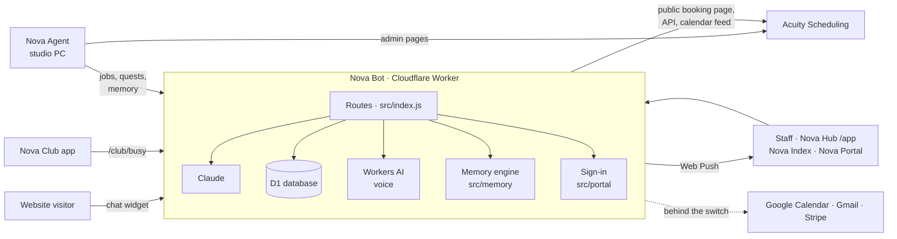
```mermaid
flowchart LR
    V[Website visitor] -->|chat widget| W
    S[Staff · Nova Hub /app<br/>Nova Index · Nova Portal] --> W
    C[Nova Club app] -->|/club/busy| W
    subgraph W[Nova Bot · Cloudflare Worker]
      R[Routes · src/index.js] --> CL[Claude]
      R --> DB[(D1 database)]
      R --> AI[Workers AI<br/>voice]
      R --> MEM[Memory engine<br/>src/memory]
      R --> PO[Sign-in<br/>src/portal]
    end
    W -->|public booking page,<br/>API, calendar feed| A[Acuity Scheduling]
    NA[Nova Agent<br/>studio PC] -->|jobs, quests,<br/>memory| W
    NA -->|admin pages| A
    W -->|Web Push| S
    W -.->|behind the switch| G[Google Calendar · Gmail · Stripe]
```

- **One Worker** serves the widget, the chat API, Nova Hub, Nova Index, Nova Portal, the
  admin pages, webhooks and a once-a-minute cron (booking pings, and reading website chats
  for memory).
- **D1** holds enquiries, chat logs (90 days), referral codes, notifications, settings,
  Nova Agent's job queue, the memory files, staff accounts and sessions and, when switched
  on, Nova Bot's own bookings (`migrations/`).
- **Secrets** live in Cloudflare (`wrangler secret put`), never in the code.

## Run it locally (sandbox)

You need [Node.js](https://nodejs.org) 20 or newer. No Cloudflare, Claude or Acuity
account is needed.

```sh
git clone https://github.com/tuniveza/nova-bot.git
cd nova-bot
npm install
npm run sandbox:setup   # creates .dev.vars from the example, and a local database
npm run sandbox         # starts it at http://localhost:8787
```

Open <http://localhost:8787>: a pretend website with the chat widget on it.

<p align="center">
  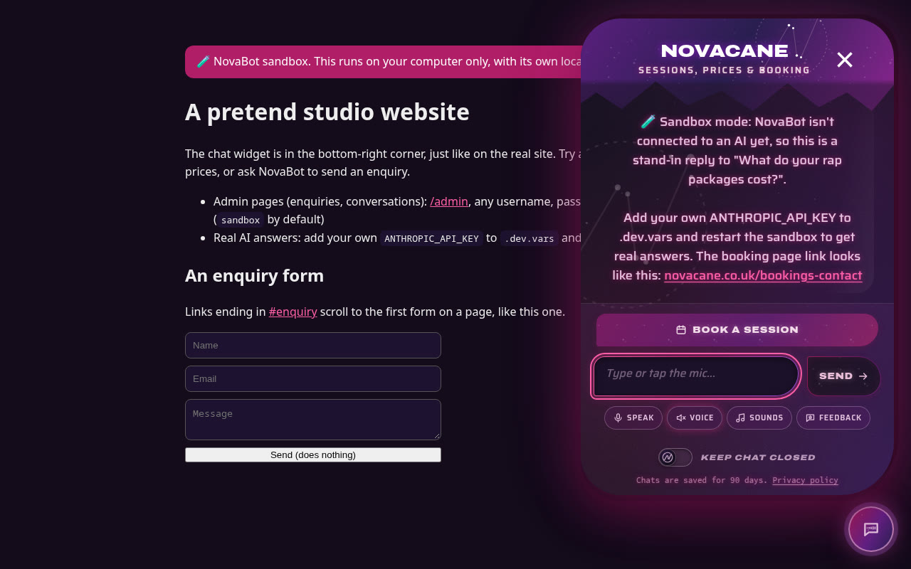<br>
  <sub>The sandbox: a pretend studio site, with clearly labelled stand-in replies when no AI key is set.</sub>
</p>

- **Everything stays on your computer.** The sandbox has its own local database and
  can't reach any live Nova Bot, database or calendar.
- **Without an AI key**, NovaBot gives clearly labelled stand-in replies, so you can try
  the widget, enquiries, Nova Hub and the admin pages for free.
- **For real answers**, put your own Claude API key
  ([console.anthropic.com](https://console.anthropic.com)) in `.dev.vars` as
  `ANTHROPIC_API_KEY=...` and restart. That uses your own Anthropic account.
- **Admin pages and Nova Hub**: <http://localhost:8787/admin> and
  <http://localhost:8787/app>, any username, password `sandbox` (set in `.dev.vars`).
- **The booking card** needs a booking system it can check times against. To try it
  offline, start the sandbox with Nova Bot's own system switched on:
  `npx wrangler dev --env sandbox --var BOOKING_SYSTEM:nova` (no Google key means the
  "calendar" is the local bookings table; no Stripe key means a local stand-in checkout).
- **Voice**: speech uses your browser's own voice; the microphone needs Workers AI, so
  it isn't available in the sandbox.

`.dev.vars` is in `.gitignore`: your keys never get committed.

## The build step

Nova Index and Nova Portal have their own folders and repos (`ns/ni` and `ns/np`). They're
served from here so they share Nova Hub's sign-in, so before every deploy or local run,
wrangler's build step (`"build": { "command": "node scripts/sync-apps.mjs" }`) copies them
in:

| From | To | What |
|---|---|---|
| `ns/ni/app/` | `public/app/memory/` | Nova Index |
| `ns/np/app/` | `public/portal/` | Nova Portal's pages |
| `ns/np/planet/` | `src/portal/planet/` | The planet generator (also draws `planet.svg`) |

The page copies are never saved in this repo (`.gitignore`). The planet generator copy is,
so the project still builds and tests on its own. If the folders aren't next to this
project, the script says so and carries on.

## Configuration

Everything secret is a **Wrangler secret** (`npx wrangler secret put NAME`), or a line in
`.dev.vars` for local runs. Names only; values never belong in the repository.

| Name | Needed for |
|---|---|
| `ANTHROPIC_API_KEY` | Claude answers and memory (required live) |
| `ADMIN_PASSWORD` | The studio's shared password (admin pages, Nova Hub, and setting up the first Portal admin) |
| `ACUITY_USER_ID`, `ACUITY_API_KEY` | Referral tracking, real-booking checks and managing bookings from Nova Hub (Acuity's Powerhouse plan) |
| `ACUITY_WEBHOOK_KEY` | Accepting Acuity's webhook (`/acuity/webhook?key=…`) |
| `ACUITY_CALENDAR_URL` | Acuity's private calendar feed: booking details, the Calendar tab and Nova Club's busy times |
| `ACUITY_EMAIL_KEY` | The Google Apps Script that forwards Acuity's emails (`tools/acuity-email-forwarder.gs`) |
| `AGENT_NOVA_KEY` | Nova Agent's routes (`/hub/agent/*`, `/hub/notify`, `/memory/*`) |
| `VAPID_PUBLIC_KEY`, `VAPID_PRIVATE_KEY` | Phone notifications (Web Push) |
| `RESEND_API_KEY`, `ENQUIRY_EMAIL_TO`, `ENQUIRY_EMAIL_FROM` | Emailing enquiries (optional) |
| `GOOGLE_CLIENT_ID`, `GOOGLE_CLIENT_SECRET` | Nova Bot's own booking system: Google Calendar and Gmail (optional) |
| `GOOGLE_REFRESH_TOKEN`, `GOOGLE_CALENDAR_ID`, `GOOGLE_ACCOUNT` | Optional overrides; normally set by "Connect Google" on `/admin/connections` |
| `STRIPE_SECRET_KEY`, `STRIPE_WEBHOOK_SECRET` | Nova Bot's own booking system: deposits (optional) |

Plain variables (in `wrangler.jsonc` or `--var`): `BOOKING_SYSTEM` (`acuity` or `nova`, the
fallback for the switch), `PUBLIC_URL`, `SANDBOX`, `BOOKING_DETAILS_WAIT_SECONDS`.

Bindings in `wrangler.jsonc`: `DB` (D1), `AI` (Workers AI), `CHAT_LIMIT`, `VOICE_LIMIT` and
`CLUB_LIMIT` (rate limits), static assets from `public/`, the build step, and a cron
trigger every minute.

More detail lives alongside this file:
[README-ENQUIRIES.md](README-ENQUIRIES.md) (enquiries, booking links, free times, chat log),
[README-REFERRALS.md](README-REFERRALS.md) (referral codes and Acuity's webhook),
[README-SQUARESPACE.md](README-SQUARESPACE.md) (adding the widget to a Squarespace site) and
[PRIVACY-POLICY-NOVABOT.md](PRIVACY-POLICY-NOVABOT.md) (privacy policy wording).

<details>
<summary><b>Booking details from Acuity's confirmation page</b> (optional back-up)</summary>

Paste this into Acuity → Integrations → Custom conversion tracking, under anything already
there, replacing `YOUR-WORKER` with your Worker's address:

```html
<!-- Nova Hub: sends this booking's details to the staff notification -->
<div id="nv-booked" hidden><i>%type%</i><i>%id%</i><i>%appointmentType%</i><i>%clientDate%</i><i>%clientTime%</i><i>%price%</i><i>%email%</i><i>%calendar%</i></div>
<script>
(function () {
  var names = ["type", "id", "session", "date", "time", "price", "email", "calendar"];
  var values = document.querySelectorAll("#nv-booked i");
  var query = names.map(function (name, i) { return name + "=" + encodeURIComponent(values[i].textContent.trim()); }).join("&");
  new Image().src = "https://YOUR-WORKER/acuity/booked?" + query;
})();
</script>
```

The main source of booking details is Acuity's private calendar feed (Acuity → Sync with
Other Calendars → 1-way Calendar Sync, saved as `ACUITY_CALENDAR_URL`), which works on every
Acuity plan and for bookings staff add themselves. Acuity's own booking emails are a second
back-up: `tools/acuity-email-forwarder.gs` runs in the mailbox Acuity emails and passes each
one to `/acuity/email`. Once emails are coming through, notifications wait for them (up to
3 minutes, then the once-a-minute cron sends them anyway).

</details>

## Nova Bot's own booking system (behind a switch)

Bookings go through **Acuity** by default. Alongside it, `src/nova/` holds Nova Bot's own
booking system, switched **off** until you choose otherwise:

- **Booking page** at `/book`, with the studio's **Google Calendar** as the diary,
  confirmation emails from the studio's **Gmail**, and deposits through **Stripe**.
- **Customer pages**: each customer gets a page to pay, move or cancel.
- **Staff tools** in Nova Hub: cancel, move, refund and send payment links.

**The switch** is on `/admin/connections`, under "Booking system". It's stored in the
`settings` table as `booking_system` (`acuity` or `nova`), and falls back to the
`BOOKING_SYSTEM` variable, then to Acuity (`src/mode.js`).

- It takes effect straight away, with no redeploy.
- Nova can only be switched on once Google and Stripe both work. Switching back to Acuity
  is always one click.
- On Acuity, everything behaves exactly as before, and the original tests prove it.
- Either way, a booking made with Nova keeps working (its page, payment links and Stripe's
  webhook), and Acuity's webhook is still listened to.

<details>
<summary><b>Setting it up</b></summary>

1. **Google:** in Google Cloud, switch on the Calendar and Gmail APIs and create an OAuth
   client (Web application) with the redirect URI `https://<worker>/admin/google/callback`.
   Then `npx wrangler secret put GOOGLE_CLIENT_ID` and `GOOGLE_CLIENT_SECRET`.
2. **Stripe:** `npx wrangler secret put STRIPE_SECRET_KEY` (use a `sk_test_…` key to try
   it). Add a webhook endpoint `https://<worker>/stripe/webhook` with the events
   `checkout.session.completed`, `checkout.session.async_payment_succeeded` and
   `checkout.session.expired`, and save its signing secret as `STRIPE_WEBHOOK_SECRET`.
3. **Database:** `npx wrangler d1 migrations apply novabot --remote`.
4. **Deploy,** then on `/admin/connections`: press **Connect Google**, press **Send a test
   email**, and flip the switch to try it.

Sessions, prices and rules (opening hours, 50% deposit, 48-hour cancellation) are in
`src/nova/studio.js`.

</details>

## Tests

```sh
npm test            # watch mode
npx vitest run      # once
```

388 tests across 27 files, fully offline: they run inside the Workers runtime
(`@cloudflare/vitest-plugin`) with a local database and fake versions of Claude, Acuity,
Google, Stripe and Resend (`test/fakes.js`). Every key in `vitest.config.mjs` is a
test-only stand-in. The original Acuity tests run against the default; `test/*-nova.spec.js`
run with the switch on Nova, and `test/switch.spec.js` tests the switch itself. The memory
engine and Nova Portal have their own (`test/memory.spec.js`, `test/portal.spec.js`).

## Deploying your own copy

1. Log in to Cloudflare: `npx wrangler login`.
2. Create the database: `npx wrangler d1 create novabot`, put its `database_id` in
   `wrangler.jsonc`, then `npx wrangler d1 migrations apply novabot --remote`.
3. Add the secrets you need from [Configuration](#configuration), at least
   `ANTHROPIC_API_KEY` and `ADMIN_PASSWORD`.
4. Swap Novacane's details for your own:
   - `src/index.js`: `BOOKING_LINK`, `ENQUIRY_LINK`, `WHATSAPP_NUMBER`, `WHATSAPP_LINK`,
     `ALLOWED_ORIGINS`, and the studio information in `STUDIO_INFO`
   - `src/booking.js`: `ACUITY_OWNER` (the number after `owner=` in your Acuity booking
     page's address)
   - `src/nova/studio.js` and `src/nova/booking.js` (`LIVE_URL`) for the Nova system
   - `public/novabot.js`: `LIVE_WORKER_URL`, `BOOKING_LINK`, `PRIVACY_LINK`
5. Deploy with `npm run deploy` (the build step copies Nova Index and Nova Portal in), then
   add the widget to your website (see [README-SQUARESPACE.md](README-SQUARESPACE.md)).
6. Open `/portal/` to set up the first admin with the studio password, then invite the team.

## Project layout

```
public/novabot.js, novabot.css   the chat widget (served by the Worker)
public/app/                      Nova Hub, the staff app (PWA + service worker)
  app.js, app.css                  the tabs, the smart calendar, alerts, voice, pings
  suite.js                         the Nova suite sheet, All links, What's changed
  options.js, themes.js/.css       Options and the six themes
  ambient.js, sfx.js               ambient music and sound effects
  sw.js                            notifications with the app closed
  memory/                          Nova Index (copied in at build time, not in git)
public/portal/                   Nova Portal's pages (copied in at build time, not in git)
src/index.js                     the Worker: chat, voice, routes, NovaBot's instructions
src/app-page.js                  Nova Hub's API (/app/api/*)
src/hub-ask.js                   Ask Nova: questions about bookings, enquiries and alerts
src/admin.js                     the admin pages
src/links.js                     the master list: links, features, changelog
src/memory/                      the memory engine (store, extract, routes)
src/portal/                      Nova Portal: sign-in, sessions, staff, planets
src/booking.js                   session types, booking links, free times (public Acuity page)
src/booking-form.js              the booking card's API
src/book-session.js              booking checks (deposit first)
src/manage-bookings.js           staff finding, cancelling, moving and changing bookings
src/agent-nova.js                jobs, quests and alerts for Nova Agent
src/enquiries.js                 enquiries, enquiry emails, chat log
src/push.js                      notifications, the Alerts tab, real-booking checks
src/booking-calendar.js          booking details from Acuity's calendar feed
src/booking-details.js           booking details from Acuity's confirmation page
src/booking-emails.js            booking details from Acuity's emails
src/booking-pings.js             when booking notifications go out
src/club-calendar.js             busy times for Nova Club
src/referrals.js                 referral tracking (Acuity API)
src/feedback.js                  what visitors said about NovaBot
src/health.js                    daily Acuity API check
src/mode.js                      the booking-system switch
src/nova/                        Nova Bot's own booking system (Google, Gmail, Stripe)
src/fonts/                       Saira, Geist Mono and Source Code Pro (SIL OFL)
migrations/                      D1 tables
test/                            Vitest tests and fakes
tools/acuity-email-forwarder.gs  Google Apps Script that forwards Acuity's emails
scripts/sync-apps.mjs            the build step: copies Nova Index and Nova Portal in
scripts/sandbox-setup.mjs        sandbox setup
docs/media/                      README images (all sample data)
```

## Part of the Nova suite

| Project | What it is |
|---|---|
| [nova-suite](https://github.com/tuniveza/nova-suite) | The Nova suite: an overview of every project |
| **[nova-bot](https://github.com/tuniveza/nova-bot)** | This repo: NovaBot, Nova Hub, the admin pages, and the engines behind Nova Index and Nova Portal |
| [nova-index](https://github.com/tuniveza/nova-index) | Nova Index: browse, fix and approve what the suite remembers |
| [nova-agent](https://github.com/tuniveza/nova-agent) | Browser helper on the studio computer: Acuity jobs, Nova Missions and Nova Quests |
| [nova-club](https://github.com/tuniveza/nova-club) | Members' Android app that shows the studio's busy times |
| [nova-calendar](https://github.com/tuniveza/nova-calendar) | A cosmic calendar of note cards and day cards |
| [nova-notes](https://github.com/tuniveza/nova-notes) | Notes and documents, with Google Docs export |
| [nova-observatory](https://github.com/tuniveza/nova-observatory) | A dashboard of every project, with screenshots and video |

## Licence

All rights reserved — Novacane Studios. The bundled fonts in `src/fonts/` keep their own
SIL Open Font Licence (see the `OFL.txt` files).
